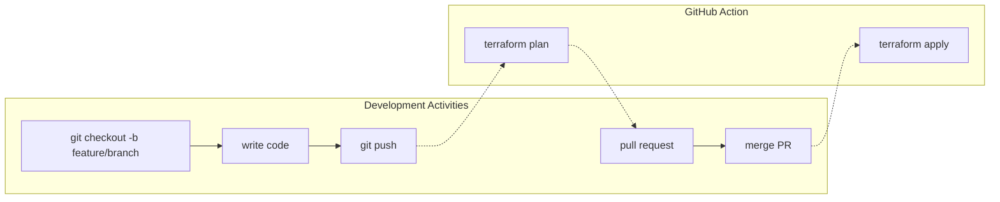

# TODO BEFORE PUBLISHING

- Remove specific values in `terraform.backend` block in the [`main.tf`](./terraform/main.tf) file
- Remove this section

# Overview

This repo provides a basic framework for working on a Terraform project in Azure using automation. It includes the following:

- A script to setup the remote backend in Azure storage, as well as create an Azure service principal that Terraform will use to apply infrastructure changes.
- A GitHub Actions workflow to automate deploying the changes to your environment with a basic CI/CD setup.

This is intended for small projects, and should not be considered a production-grade workflow.

## Prerequisites

- Azure subscription
- GitHub repo

## Development Workflow

The development workflow is as follows:



# Steps to Get Started

1. Run the [PowerShell script in this repo](/scripts/powershell/SetUpTerraformRemoteBackend.ps1) to set up the resource group and storage account where Terraform's remote state will be managed, as well as create the service principal that Terraform will use to apply all infrastructure changes.
    
    _**IMPORTANT:** Be sure to capture the detailsfrom the output of the PowerShell script (particularly the client secret), as you will need that information in the next step._
1. Populate the following details in the `terraform.backend` block in the [`main.tf`](./terraform/main.tf) file in the repository - the PowerShell script will provide you with the values in angled brackets (`<>`):
    ```
    backend "azurerm" {
        resource_group_name  = "<RESOURGE_GROUP_NAME>"
        storage_account_name = "<STORAGE_ACCONT_NAME>"
        container_name       = "<CONTAINER_NAME>"
        key                  = "<CONTAINER_NAME>.tfstate"
    }
    ```
1.
1.